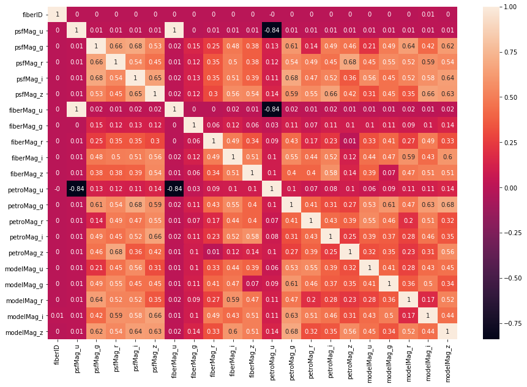
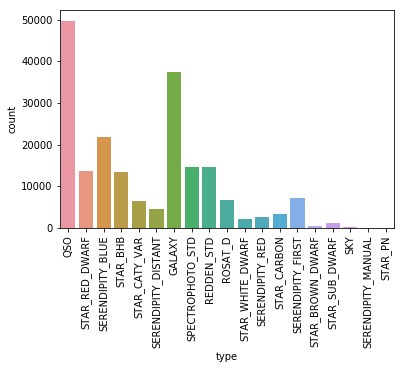
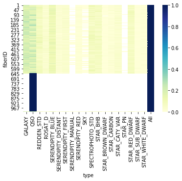
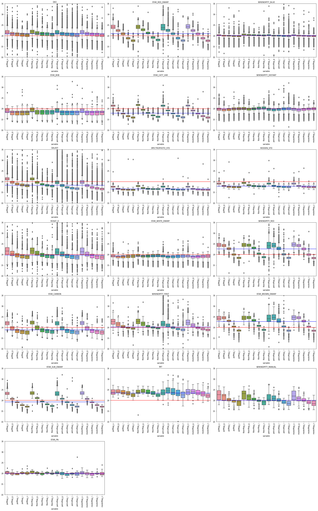

Index  
1. [대회안내](#대회안내)
2. [진행과정](#진행과정)
3. [배경지식](#배경지식)
4. [후기](#후기)

# 대회안내
[출처-Dacon](https://dacon.io/competitions/official/235573/overview/description/)

1. 배경

최근 인류에게 다가온 빅데이터라는 단어는 우주와 천문학에게 낯설지 않습니다.  
찰나의 순간에도 우주는 천문학적인 양의 데이터를 생산해왔고, 오래 전부터 천문학자들은 우주를 관측했으며, 그 방대함에 비례하는 데이터를 수집 및 분석했기 때문입니다. 
슬론 디지털 천체 관측(Sloan Digital Sky Survey: 이하 SDSS)는 세계적 천체 관측 프로젝트로, 우주에 대한 천문학적인 규모의 데이터를 수집하고 있습니다.   
이곳에서 수집한 데이터는 약 6,000개 논문에 사용되었고, 25만 회 이상 인용되었을 정도로 천문학에 큰 기여를 했습니다.  
점점 거대해지는 규모에 따라 데이터 처리에는 머신러닝과 딥러닝 기법이 활용되기 시작했습니다.  
여전히 우주에는 다양한 미지의 이야기가 남아있고, 오늘날 인간은 하늘에서 많은 데이터를 얻어낼 정도로 발전했습니다.  
이 데이터를 분석하여 어쩌면 드러나지 않은 규칙이 여러분의 손끝에서 밝혀질 수 있습니다.   
새로운 알고리즘을 통해 우주의 비밀을 찾아주세요!  

2. 규칙  
최대 팀 인원: 3명  
최대 제출 횟수: 96회  
일일 최대 제출: 3회  
채점 방식: LogLoss  

    1. 평가  
        본 대회에서는 LogLoss로 제출 파일을 평가합니다.  
        a) 가채점 순위 : 대회 중 test 데이터의 30%로 채점합니다.  
        b) 최종 순위 : 가채점에서 사용하지 않은 나머지 test 데이터로 채점합니다. 대회 종료 후에 공개됩니다.  
        최종순위는 참가자가 선택한 파일로 채점되므로, 참가자는 자신이 채점 받고 싶은 제출 파일을 최종적으로 선택해야 합니다.  
    2. 외부 데이터  
        본 대회에는 어떠한 외부데이터 사용이 불가합니다.  
    3. 참가 방법  
        - 개인 참가 방법 : 팀 신청 없이, 자유롭게 제출 창에서 제출 가능    
        - 팀 참가 방법  

        a) 팀장, 팀원 모두 참여하기 버튼 클릭하기  
        b) 팀장이 각 팀원을 검색 (닉네임 or ID or 가입 이메일), 해당 팀원 합체 요청  
        c) 각 팀원은 팀장으로부터 온 팀 병합 요청 수락  
        d) 팀 참가 완료  
            * 한 번 팀으로 등록되면 어떠한 경우에도 팀 탈퇴 및 개인 참여가 불가능합니다.  
            * 하나의 대회에는 하나의 팀으로만 등록이 가능합니다.  
            * 팀의 수상 요건 충족 시 팀의 대표가 수상하게 됩니다.  
    4. 코드  
        1) 입상자는 코드 제출 필수. 제출 코드는 예측 결과를 리더보드 점수로 복원할 수 있어야 함  
        2) 코드 제출시 확장자가 R user는 R or .rmd. Python user는 .py or .ipynb  
        3) 코드에 ‘/data’ 데이터 입/출력 경로 포함 제출  
        4) 전체 프로세스를 일목요연하게 정리하여 주석을 포함하여 하나의 파일로 제출  
        5) 모든 코드는 오류 없이 실행되어야 함(라이브러리 로딩 코드 포함되어야 함).  
        6) 코드와 주석의 인코딩은 모두 UTF-8을 사용하여야 함  
    5. 토론(질문)  
        해당 대회에서는 대회 운영 및 데이터 이상에 관련된 질문 외에는 답변 드리지 않을 예정입니다.  
        결측치 처리 방법, 모델 구성 방법 등등 대회 운영 및 데이터 이상 외 질문은 토론 페이지를 통해 자유롭게 토론해 주시기 바랍니다.  
        * 데이콘 답변을 요청하는 경우 토론 제목에 [DACON 답변 요청] 문구를 넣어 질문을 올려 주시기바랍니다. 예) [DACON 답변 요청] 시상식은 언제 열리나요?  
3. 컬럼 설명
    * type(Source type) : 천체의 분류 예측을 해야하는 변수
    * psfMag(Point spread function magnitudes): 먼 천체를 한 점으로 가정하여 측정한 빛의 밝기입니다.
    * fiberMag(Fiber magnitudes) : 3인치 지름의 광섬유를 사용하여 광스펙트럼을 측정합니다. 광섬유를 통과하는 빛의 밝기입니다.
    * petroMag(Petrosian Magnitudes) : 은하처럼 뚜렷한 표면이 없는 천체에서는 빛의 밝기를 측정하기 어렵습니다. 천체의 위치와 거리에 상관없이 빛의 밝기를 비교하기 위한 수치입니다.
    * modelMag(Model magnitudes) : 천체 중심으로부터 특정 거리의 밝기입니다.
    * fiberID : 관측에 사용된 광섬유의 구분자

# 진행과정
1. EDA  
* 기본특성   
변수의 개수 : fiberID는 총 1000개, type은 총 21개   
변수의 특성 : Magnitute의 모든 값들은 19~21 사이의 범위에 해당함  
변수간 상관관계 : psfMag_u, fiberMag_u, petroMag_u간의 상관관계 확인   

* type에 따른 개수 : QSO, GALAXY가 가장 많았으며, STAR_PN, SERENDIPITY_MANUAL 각각 61개 13개로 가장 적어 예측이 다소 어려울 것으로 추정 

  
* fiberID에 따른 개수 : fiberID에 따른 데이터 분포는 균등하지 않으며, 표본이 10개 이하인 fiberID도 존재함, 또한 641번 fiberID 이후 모든 데이터는 QSO에 집중분포됨

* type에 따른 magnitue  
각 타입에 따른 features 확인 type별로 다소 다른 분포를 보이는 것을 확인가능 

2. feature engineering
* ugriz band 변수간 차이   
color-color map을 참고하여 ugriz band간의 차이를 추가변수로 추가   
ex) u-g, g-r, r-i, i-z  
* mag별 가능한 모든 차이 조합  
ex) psfmag : u-g, u-r, u-i, u-z ... etc
* ~~mag별 가장 높은 값의 filter를 새로운 변수로 추가~~
    - category변수 추가를 지양하기로 하여 배제
* ~~가능한 모든 조합의 차~~  
ex) psfmag_u - fibermag_u 
    -  변수량의 큰 증가 및 psfmag_u - fibermag_u와 같은 u band간에서 큰 상관관계 발생하여 배제
* ~~PCA를 활용하여 ugriz_band별 통합~~  
ex) psfmag_u, fibermag_u, petromag_u, modelmag_u -> PCA_u  
    - 각 밴드별로 강한 상관관계를 가지고 있어서 배제
* ~~ugriz band별 통계값(평균, 표준편차, 최소, 중앙, 최대)~~  
ex) u_mean, u_std etc
    - u 밴드에서 강한 상관관계를 가지고 있으며, 다른 밴드에서도 유사하여 배제
* ~~fiberID에 따른 통계값 magnitude(평균, 표준편차, 최소, 중앙, 최대)~~  
ex) median_psfMag, std_fiberMag
    - fiberID는 기초모델로 feature importance를 확인했을때 가장 영향력이 높았으므로, 이를 활용하여 추가변수 생성을 시도 그러나, 다른 magnitude와 비슷하여 기각
* fiberID에 따른 통계값 ugriz band(평균, 표준편차, 최소, 중앙, 최대)  
ex) mean_u, std_u
    - magnitude와 다르게 median, std는 상관관계가 높지 않으므로 활용성이 높다 판단

3. Modeling 
 

# 배경지식
* QSO(quasi-stellar object) [퀘이사](https://ko.wikipedia.org/wiki/%ED%80%98%EC%9D%B4%EC%82%AC)
    - 스펙트럼은 0.05 ~ 7의 적색편이를 갖음
    - 퀘이사의 질량은 10^6 ~ 10^9 M
    - 퀘이사는 지구에서 관측할수 있는 가장 먼 거리에 있는 천제로 강한 에너지를 방출하는 활동은하. 
    - 퀘이사는 지금까지 우주에서 발견될 천체들 중 가장 밝고 강력하여 활동적인 천체이다. 
    - 우주의 팽창 때문에 매우 큰 적색편이 값을 갖는다.
* galaxy [은하](https://ko.wikipedia.org/wiki/%EC%9D%80%ED%95%98)
    - 은하들은 작은 것들은 1천만(107) 개 이하의 항성으로 이루어져 있고,큰 것들은 100조(1014)여 개의 항성들을 가지고 있음
    -  항성, 밀집성, 성간 물질, 암흑 물질 등이 중력에 의해 묶여져서 이루는 거대한 천체들의 무리

* SPECTROPHOTO_STD (spectrophotometry standard (typically an F-star)) [F형_주계열성](https://ko.wikipedia.org/wiki/F%ED%98%95_%EC%A3%BC%EA%B3%84%EC%97%B4%EC%84%B1)
    - 주계열성 중 분광형 F에 속하는 항성이다. 질량은 태양의 1 ~ 1.4배에 표면 온도는 6000 ~ 7600 켈빈이다
    - 주계열성을 왜성(矮星)으로 달리 부르기도 하는데, 이에 따라 F형 주계열성을 황백색 왜성으로 부르기도 한다
* REDDEN_STD (reddening standard star)
    - 적색왜성이 되기전단계로 추정 (reddening : 적색화)
* STAR_RED_DWARF [적색왜성](https://ko.wikipedia.org/wiki/%EC%A0%81%EC%83%89%EC%99%9C%EC%84%B1)
    - 우주에 있는 별들의 약 90퍼센트 정도가 적색왜성인 것으로 알려져 있다
    - 태약무게의 50~70%
    - 헬륨과 수소를 연료로 순환해서 씀, 수명이 1~10조년
    - 낮은 광도때문에 개개의 적색왜성을 관측하기 쉽지않다. 실제로 지구에서 육안으로 관찰할 수 있는 적색왜성은 없다.

* STAR_BHB(blue horizontal-branch stars) [수평거성열](https://ko.wikipedia.org/wiki/%EC%88%98%ED%8F%89%EA%B1%B0%EC%84%B1%EC%97%B4)
    - 태양의 질량의 2.3배까지의 질량을 가진 주계열성에서, 중심핵에서의 수소의 핵융합(p-p 연쇄)은 주로 별의 질량에 의해 결정되는 융합률
    - _적색왜성이 적색거성이되는 단계로추정_

* STAR_CATY_VAR (cataclysmic variables) [격변변광성](https://ko.wikipedia.org/wiki/%EA%B2%A9%EB%B3%80%EB%B3%80%EA%B4%91%EC%84%B1)
    - 밝기가 큰 폭으로 급작스럽게 밝아졌다가 순식간에 뚝 떨어지는 항성

* STAR_CARBON (dwarf and giant carbon stars) [탄소별(영문)](https://en.wikipedia.org/wiki/Carbon_star)
    - 적색거성에 속하는 별 
* STAR_WHITE_DWARF [백색왜성](https://ko.wikipedia.org/wiki/%EB%B0%B1%EC%83%89%EC%99%9C%EC%84%B1)
    -  중간 이하의 질량을 지닌 항성이 핵융합을 마치고 도달하는 천체
    -  에너지를 생성할 수 없기 때문에 점차 식어가게 되며, 또한 핵이 중력에 의해 붕괴하는 것을 막지 못하고, 결국 매우 밀도가 높은 상태가 된다
* STAR_SUB_DWARF (low-luminosity subdwarfs) [준왜성](https://ko.wikipedia.org/wiki/%EC%A4%80%EC%99%9C%EC%84%B1)
    - 이들은 같은 표면온도의 주계열성에 비해 밝기가 1.5에서 2등급 정도 낮다

* STAR_BROWN_DWARF [갈색왜성](https://ko.wikipedia.org/wiki/%EA%B0%88%EC%83%89%EC%99%9C%EC%84%B1)
    - 초기질량이 태양의 7.5%배 이하(목성 질량의 80배 이하)인 별
    - 갈색왜성은 적색왜성보다 수소가 적으며 핵융합을 지속할 수 없음
    - 핵융합을 할수 없기에 거의 빛을 내지 못함
* SKY (sky target) 
    - 빈영역? 다크메터(암흑물질)로 이뤄진 공간

* STAR_PN (central stars of planetary nebulae) 
    - 행성상성운의 중심에 있는 별 [행성상성운](https://ko.wikipedia.org/wiki/%ED%96%89%EC%84%B1%EC%83%81%EC%84%B1%EC%9A%B4)
        - 행성상성운의 수명은 수만 년 정도로, 별의 수명이 수십억 년 정도인 바, 우주적 규모에서는 상대적으로 짧게 지속되는 현상
        - 발광성운의 일종으로, 늙은 적색거성의 외피층이 팽창하여 형성된 전리 기체들로 이루어져 있다
* SERENDIPITY_FIRST (coincident with FIRST sources but fainter than the equivalent in quasar target selection (also includes non-PSF sources))
    - 첫번째 관측에서 퀘이사로 분류되었지만, 이어진 관측에서는 더 흐릿한 천체
* SERENDIPITY_MANUAL (manual serendipity flag)
    - 수동으로 관측된 천체
* ROSAT_D (ROSAT All-Sky Survey match, are otherwise bright enough for SDSS spectroscopy)
    -  X-선 파장대에서 관측한 천체이지만, SDSS 망원경에서도 관측되는 천체
* SERENDIPITY_BLUE (lying outside the stellar locus in color space)
* SERENDIPITY_RED (lying outside the stellar locus in color space) 
* SERNDIPITY_DISTANT (lying outside the stellar locus in color space)
    - 항성 구역 외부에 놓인 천체
# 후기

* 정현
    * 아쉬운점  
    다소 오랜만에 배경지식이 부족한 분야를 하다보니 데이터 접근에서 다소 겁을 먹었음. 특히, 계속 부족한 도메인지식에 붙잡혀 추가변수를 만들어 내는데 있어서 과감하게 진행하지 못했음. (대회 후반기에 추가변수 생성을 시도)  
    또한 Sudden Death라는 형태의 대회로 인해 매일 제출을 의무화하게 되었으나, 큰 발전이 없어도 무리하게 올리지 않았나 하는 생각이 듬.  
    모델링에 많은 시간을 투자하면 될 것이란 생각에 하이퍼파라미터 시도를 많이 해봤으나, 실제로는 feature engineering에 더 시간을 할애해야 했음.
    * 좋았던점
    우주천체와 같은 주제는 이번 대회가 아니었으면, 접할 일이 드물지만, 이를 통해서 다양한 지식을 접할 수 있었음.   
    다른 사람들의 솔루션을 통해서 feature를 확장시키는 것에 더 겁먹지 않아야겠다는 생각을 함. (물론 그 근거가 더 확실하면 좋을 듯)  

# 출처 
[SDSS_type](https://skyserver.sdss.org/dr12/en/help/docs/QS_UserGuide.aspx)  
[SDSS_ugriz_bands](http://skyserver.sdss.org/dr1/en/proj/advanced/color/sdssfilters.asp)  
[SDSS_용어사전?](http://www.sdss3.org/dr10/help/glossary.php)  
